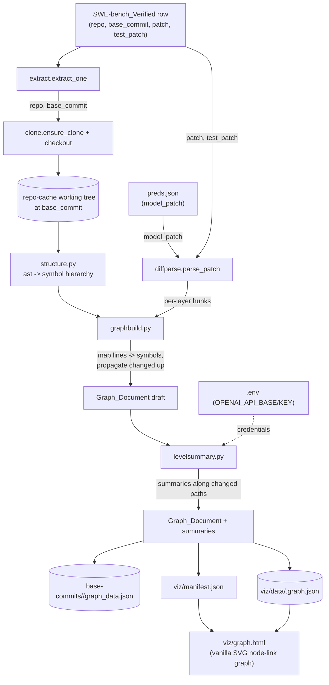

# Design Document

## Overview

This design evolves the SWE-bench change-visualization tooling into a progressive, multi-level **change graph** for a single prototype instance (`scikit-learn__scikit-learn-13496`). It adds three Python components and one new static viewer, and reuses the existing pipeline (`extract.py`, `clone.py`, `diffparse.py`, `summarize.py`) wherever possible.

The pipeline:

1. Reuses `extract` + `clone` to check out the repo at its base commit (the `Base_Commit_Sources`).
2. Reuses `diffparse` to parse the model/gold/test patches into per-file hunks with new-side line numbers.
3. **New** `structure.py` (`Structure_Extractor`) parses each Python file with `ast` into a symbol hierarchy (module → imports/consts/classes → methods/functions) with line ranges.
4. **New** `graphbuild.py` (`Graph_Builder`) assembles the directory→module→symbol node hierarchy, maps each changed line onto the innermost containing symbol per layer, propagates `changed` flags up to the root, and emits the `Graph_Document`.
5. **New** `levelsummary.py` (`Level_Summarizer`) walks only the changed paths, summarizing changed leaves from their diffs and rolling those up into module/dir summaries via the reused `summarize` endpoint helper, with graceful fallback.
6. **New** `graph.html` (`Graph_Viewer`) renders the `Graph_Document` as a collapsible vanilla-SVG node-link graph with a code/diff detail pane; it replaces the old `index.html` tree viewer.

The build is driven by a new entrypoint `build_graph.py` (sibling to the existing `build_viz.py`), scoped to the single `Target_Instance`.

### Verified facts this design is grounded in

- `trace-simulations/viz/diffparse.py` exposes `parse_patch(text) -> list[FileDiff]`, where `FileDiff` has `path`, `added`, `removed`, `hunks`, and each `Hunk` has `old_start`, `new_start`, `header`, and `lines` (each `LineChange` has `kind` ∈ {add, remove, context}, `content`, `old_lineno`, `new_lineno`). The **new-side** line numbers (`new_lineno`, `new_start`) are what we map onto AST line ranges, because the AST is parsed from the checked-out (post-... actually base-commit) source — see "Line-number basis" below.
- `clone.ensure_clone` / `clone.checkout` already cache repos under `.repo-cache/<org>__<repo>` and check out the base commit; `extract.load_dataset_index` + `extract.extract_one` give `repo`, `base_commit`, and the gold `patch` / `test_patch` from the dataset row.
- `summarize.load_credentials`, `summarize.summarize_file`, `summarize.fallback_summary`, and `summarize.DEFAULT_MODEL` ("openai/openai/gpt5_6_luna") already implement the CreateAI endpoint call with secret hygiene and fallback; `Level_Summarizer` reuses them.
- The model patch for the Target_Instance lives in `trace-simulations/logs/preds/gpt5_6_luna/preds.json` and touches `sklearn/ensemble/iforest.py` across 3 hunks (docstring + `__init__` signature + `super().__init__` call), which exercises module→class→method highlighting.
- The repo at the base commit is on disk after clone, so `ast.parse` runs against real files.

### Line-number basis (important correctness detail)

The AST is parsed from the files **as checked out at the base commit** (pre-change). A unified diff's hunk describes a transformation from old (base) to new. Therefore the **old-side** line numbers (`old_lineno`, `Hunk.old_start`) are the ones that index into the base-commit source the AST was built from. The `Graph_Builder` maps a changed line to a symbol using the **old-side** line number for `remove` and `context` lines; for pure additions (no old-side number) it attributes the change to the symbol containing the nearest surrounding old-side line (the hunk's anchor), falling back to the module. This is called out explicitly because mixing up the basis would mis-attribute changes. For a prototype on one instance the anchor heuristic is sufficient and is unit-tested against the known `iforest.py` hunks.

## Architecture

### Module layout

```
trace-simulations/
  build_graph.py            # NEW entrypoint: builds the Graph_Document for the Target_Instance
  viz/
    __init__.py
    extract.py              # reused (Base_Commit_Extractor)
    clone.py                # reused (Repo_Cloner)
    diffparse.py            # reused (unified-diff parser)
    summarize.py            # reused (LLM endpoint call + fallback)
    structure.py            # NEW: Structure_Extractor (ast -> symbol hierarchy)
    graphbuild.py           # NEW: Graph_Builder (hierarchy + change mapping + propagation)
    levelsummary.py         # NEW: Level_Summarizer (changed-path summaries, rollup)
    graph.html              # NEW: Graph_Viewer (replaces index.html)
    data/
      <instance_id>.graph.json   # the Graph_Document (served to the viewer)
    manifest.json           # updated to point at the graph document
  base-commits/
    <instance_id>/
      graph_data.json        # canonical copy of the Graph_Document
```

**Old-pipeline cleanup.** The new graph build makes several old-pipeline artifacts dead code; they are removed so the prototype carries no unused functionality:

- `viz/index.html` — the old flat file-tree viewer; replaced by `graph.html`.
- `viz/treebuild.py` — the old whole-file-tree builder; replaced by `graphbuild.py`. Verified that nothing retained imports it.
- `build_viz.py` — the old orchestrator producing the flat `viz_data.json`; replaced by `build_graph.py`. Verified that nothing retained imports it.
- The old flat outputs for **all four** instances: `base-commits/<id>/viz_data.json` and `viz/data/<id>.viz_data.json`. The `base-commits/<id>/metadata.json` records are **kept** (base-commit extraction remains a useful standalone capability).

Retained and reused: `extract.py`, `clone.py`, `diffparse.py`, `summarize.py`. The base-commit extraction capability (`extract.py` + `metadata.json`) is explicitly preserved.

### Pipeline data flow



## Components and Interfaces

### Structure_Extractor (`viz/structure.py`)

Parses one Python file into a symbol tree using `ast`. Pure, no I/O beyond reading the file; fully unit-testable.

```python
@dataclass
class Symbol:
    kind: str            # "module" | "import" | "const" | "class" | "function"
    name: str
    start: int           # 1-based start line (inclusive)
    end: int             # 1-based end line (inclusive)
    children: list["Symbol"]

def extract_symbols(source: str, module_name: str) -> Symbol:
    """Parse `source` with ast into a module Symbol. On SyntaxError, return a
    bare module Symbol with no children (Req 1.5)."""
```

Decisions:
- Uses `ast.parse`; walks the module body. `ast.Import` / `ast.ImportFrom` → `import` nodes (name = the imported names joined, or module). Module-level `ast.Assign` / `ast.AnnAssign` whose target is a Name → `const` nodes. `ast.ClassDef` → `class` nodes; their body `FunctionDef`/`AsyncFunctionDef` → nested `function` nodes. Top-level `FunctionDef`/`AsyncFunctionDef` → `function` nodes (Req 1.2, 1.3).
- Line ranges use `node.lineno` and `node.end_lineno` (Python 3.8+; the `trace-sims` env is 3.11), with decorators included by taking the min of decorator linenos (Req 1.4).
- `SyntaxError` or any parse error → a module Symbol with no children (Req 1.5). Non-Python files never reach this component; `graphbuild` represents them as plain file nodes (Req 1.6).
- Imports and consts get `start == end == lineno` (single-line granularity is enough for a prototype).

### Graph_Builder (`viz/graphbuild.py`)

Builds the directory tree down to files, attaches each file's symbol tree, then overlays changes.

```python
def build_graph(repo_dir: Path, model: list[FileDiff], gold: list[FileDiff],
                test: list[FileDiff]) -> dict:
    """Return the Graph_Document root node."""
```

Node shape (the `Graph_Document`):

```json
{
  "id": "sklearn/ensemble/iforest.py::class:IsolationForest::function:__init__",
  "kind": "function",
  "name": "__init__",
  "path": "sklearn/ensemble/iforest.py",
  "start": 178, "end": 205,
  "changed": true,
  "change_state": "direct",          // "none" | "ancestor" | "direct"
  "annotations": {
    "model": { "added": 3, "removed": 2, "hunks": [ /* diffparse hunk_to_json */ ] }
  },
  "summary": "Adds a warm_start parameter and forwards it to the base estimator.",
  "children": [ /* nested nodes */ ]
}
```

Decisions:
- **Directory/module scaffold**: walk the working tree (reusing the ignore rules and size caps conceptually from `treebuild`, re-implemented minimally here to avoid coupling), producing `dir` nodes and, for each file, a `module` node. For Python files, `structure.extract_symbols` fills the module's children; for non-Python files the module node has no children (Req 1.6).
- **Change mapping** (Req 2.1, 2.2): for each layer's `FileDiff`, find the file's module node; for each hunk, for each changed line, use the **old-side** line number (see "Line-number basis") to locate the innermost symbol whose `[start, end]` contains it via a recursive descent; pure additions use the hunk's old-side anchor. A line inside the file but outside any symbol attaches to the module node (Req 2.2). If the module has no symbols, all changes attach to the module node (Req 2.5).
- **Annotation** (Req 2.3, 2.6): each touched node accrues `annotations[layer] = {added, removed, hunks}`; layers are kept separate. `hunks` are stored only on **directly changed leaf** nodes (functions/classes/modules) to keep the document small; ancestors carry aggregated counts but not raw hunks (Req 3.3).
- **Propagation** (Req 2.4, 3.4): after mapping, a post-order pass sets `change_state`: `direct` for nodes with their own annotation, `ancestor` for nodes with a changed descendant, `none` otherwise; `changed = change_state != "none"`. Ancestors aggregate per-layer added/removed sums from descendants.
- `id` is a stable string: file path plus a `::kind:name` chain, so the viewer and summarizer can reference nodes unambiguously.

### Level_Summarizer (`viz/levelsummary.py`)

Walks only changed paths and summarizes bottom-up, reusing `summarize`.

```python
def summarize_graph(root: dict, env_path: Path, model: str) -> None:
    """Attach `summary` to every node with change_state != 'none', bottom-up."""
```

Decisions:
- **Changed-paths only** (Req 4.1, 4.4): a node is summarized iff `change_state != "none"`. Unchanged siblings are skipped entirely — no endpoint call, no token spend.
- **Leaf summaries** (Req 4.2): a `direct` function/class/module node is summarized from its diff hunks (reusing `summarize.summarize_file` with the node's combined hunk text).
- **Rollup** (Req 4.3): a `module`/`dir` (or `class` with changed methods) node is summarized from a compact prompt built from its changed children's names + their summaries + aggregated counts. This is a second, distinct prompt ("Summarize the overall change across these children in one sentence.").
- **Endpoint + hygiene** (Req 4.5, 4.6, 4.7): reuses `summarize.load_credentials` and the litellm `openai/` double-prefix model (default `summarize.DEFAULT_MODEL`). Any failure → `summarize.fallback_summary`-style templated text; a top-level `generated_with_llm` flag records whether all summaries were real. The token is never written to the document.
- **Order**: post-order traversal so children are summarized before parents (parents consume child summaries).

### Graph_Viewer (`viz/graph.html`)

Single self-contained static HTML; inline CSS + vanilla JS; renders with SVG. Replaces `index.html`.

Decisions:
- **Rendering** (Req 5.1, 5.5): a hand-rolled SVG node-link layout. Nodes are drawn as rounded rects with a kind icon/label; edges are SVG paths expressing containment (parent→child). A simple left-to-right tidy-tree layout computed in JS (no D3): assign each visible node a depth (x) and an incrementally allocated y; draw cubic-bezier links. This is adequate for the modest number of **visible** (expanded) nodes.
- **Collapse model** (Req 5.2, 5.3): the viewer computes, from `change_state`, an initial expansion set = exactly the changed paths (root → each `direct` node). Unchanged subtrees are collapsed (their children not laid out) and shown as a collapsed node with a count badge. Activating a node (click/Enter) expands it by one level; activating again collapses it.
- **Highlighting** (Req 5.4): node fill/stroke encodes `change_state` (direct = solid accent, ancestor = outlined accent, none = neutral); per-layer accent colors (model/gold/test) shown as small chips/segments on changed nodes, with a legend and layer toggles. Not color-alone: kind label + a textual `+adds/−removes` badge + a "changed/·" marker.
- **Detail pane** (Req 6): selecting a node opens a side pane showing (a) its summary, (b) for `direct` nodes, the per-layer diff hunks (add/remove/context styled), and (c) for function/class nodes, the node's source lines (sliced from the module's stored content by `start..end`) as context next to the diff. For `ancestor` nodes, the pane shows the summary and the aggregated descendant change counts (Req 6.4).
- **Serving** (Req 5.6): loads `manifest.json` then `data/<id>.graph.json` via `fetch`; documents the `file://` limitation and the `python -m http.server` command inline.
- **Source lines for context** (Req 6.3): the Graph_Builder stores, on each `direct` function/class node, a `source` string = the symbol's base-commit lines, so the viewer can show real code without needing the whole file. (Module `content` is not inlined wholesale, to keep the document small.)

### Orchestrator (`build_graph.py`)

```python
TARGET_INSTANCE = "scikit-learn__scikit-learn-13496"

def main():
    # args: --preds, --out, --viz-root, --cache, --env, --summary-model, --no-summaries, --instance
    # 1 extract_one -> metadata (repo, base_commit, patch, test_patch)
    # 2 ensure_clone + checkout
    # 3 diffparse.parse_patch on model/gold/test
    # 4 graphbuild.build_graph
    # 5 levelsummary.summarize_graph (unless --no-summaries)
    # 6 write base-commits/<id>/graph_data.json + viz/data/<id>.graph.json + update manifest.json
```

Defaults to the single `Target_Instance` (Req 7.1); `--instance` is accepted so the same entrypoint can build the others later. Reuses the existing modules (Req 7.2). Runs its summaries with the LLM endpoint **on by default** (the user asked for real summaries), with `--no-summaries` available for offline runs.

## Data Models

### `Graph_Document` (per instance)

```json
{
  "instance_id": "scikit-learn__scikit-learn-13496",
  "repo": "scikit-learn/scikit-learn",
  "base_commit": "<sha>",
  "generated_with_llm": true,
  "layers": ["model", "gold", "test"],
  "root": { "kind": "dir", "name": "", "path": "", "change_state": "ancestor",
            "changed": true, "children": [ /* ... */ ] }
}
```

Node fields: `id`, `kind` ∈ {dir, module, import, const, class, function}, `name`, `path`, optional `start`/`end` (symbols), `changed`, `change_state` ∈ {none, ancestor, direct}, `annotations` (per-layer `{added, removed, hunks?}`), optional `summary`, optional `source` (direct class/function only), `children`.

### `manifest.json` (updated)

```json
{ "viewer": "graph.html",
  "instances": [ { "instance_id": "scikit-learn__scikit-learn-13496",
                   "repo": "scikit-learn/scikit-learn",
                   "data": "data/scikit-learn__scikit-learn-13496.graph.json" } ] }
```

## Error Handling

- **Unparseable Python** (Req 1.5): `ast.parse` failure → bare module node; builder attributes file changes to the module node.
- **Change line maps nowhere** (addition at EOF, shifted ranges): fall back to the module node so no change is lost.
- **Endpoint failure / missing creds** (Req 4.6): per-node fallback summary; `generated_with_llm=false`.
- **Instance missing from dataset**: reported, non-zero-ish message, no document written.
- **`file://` viewer use**: documented; must serve over HTTP.

## Performance and Size Considerations

- Only changed paths are summarized, bounding LLM calls to a handful for this instance.
- `ast` extraction runs on every Python file in the repo, but scikit-learn is ~1200 files; this is a one-time pass and acceptable for a prototype. Non-Python and unparseable files are cheap (no symbol tree).
- `hunks` and `source` are stored only on `direct` nodes; ancestors carry counts only — this keeps the document far smaller than the old whole-file-content `viz_data.json`.
- The viewer lays out only expanded nodes, so SVG stays light regardless of total repo size.

## Testing Strategy

Unit tests target the two pure modules; the I/O-heavy paths (clone, endpoint) are covered by a single-instance smoke build.

- **`structure.py`**: on small source snippets, assert extraction of imports, module consts, a class with methods, a top-level function, correct line ranges, and that a `SyntaxError` snippet yields a childless module node.
- **`graphbuild.py`**: using the real `iforest.py` model hunks (from `preds.json`) against the real base-commit file, assert the change maps to `IsolationForest` → `__init__` (and the class docstring hunk to the class node), that ancestors (`module`, `sklearn/ensemble`, …) become `ancestor`, and that layers stay separate. Also assert a module-with-no-symbols attributes changes to the module node.
- **Smoke build**: run `build_graph.py --no-summaries` for the Target_Instance and assert the `Graph_Document` + manifest are written and that the changed path to `__init__` exists with `change_state == "direct"`.

## Correctness Properties

### Property 1: Symbol extraction records valid, nested line ranges

*For any* Python source parsed by `extract_symbols`, every extracted Symbol SHALL have `1 <= start <= end`, and every child Symbol's range SHALL be contained within its parent's range.

**Validates: Requirements 1.2, 1.3, 1.4**

### Property 2: Unparseable or non-Python files never lose their file node

*For any* file that is non-Python or fails `ast.parse`, the Graph_Document SHALL still contain exactly one module/file Node for it with no sub-symbols.

**Validates: Requirements 1.5, 1.6**

### Property 3: Every changed line maps to exactly one innermost node

*For any* changed line in a layer, the Graph_Builder SHALL attribute it to exactly one Node — the innermost symbol containing it, or the enclosing module when no symbol contains it.

**Validates: Requirements 2.1, 2.2, 2.5**

### Property 4: Change propagation reaches the root

*For any* directly changed Node, every ancestor up to the root SHALL have `change_state` ∈ {ancestor, direct} and `changed == true`.

**Validates: Requirements 2.4, 3.4**

### Property 5: Layers remain distinct

*For any* Node changed by more than one Layer, the Node's `annotations` SHALL contain a separate entry per Layer with that Layer's own counts.

**Validates: Requirements 2.6, 3.2**

### Property 6: Summaries exist exactly on changed paths

*For any* Node, the Node SHALL carry a `summary` if and only if its `change_state != "none"`.

**Validates: Requirements 4.1, 4.4**

### Property 7: Credentials never leak

*For any* run, the credential values read from `.env` SHALL NOT appear in the Graph_Document or any written artifact.

**Validates: Requirements 4.7, 7.5**
