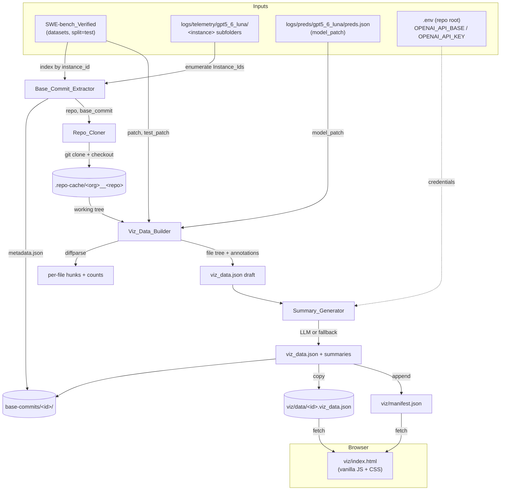

# Design Document

## Overview

This design describes the `Change_Viz_Tooling` added under `trace-simulations/`: a small Python data-generation pipeline plus a single self-contained static HTML viewer. The pipeline reads the SWE-bench Verified dataset for the four `Target_Tasks`, clones each repository at its `Base_Commit`, walks the working tree, overlays per-file / per-line change annotations for the `Model_Patch`, `Gold_Patch`, and `Test_Patch`, generates per-file natural-language summaries via the CreateAI `LLM_Endpoint` (with a deterministic fallback), and emits one `viz_data.json` per instance that the `Viewer` renders.

The design follows the conventions already established by `pick_instances.py` and `build_telemetry.py`: standard library plus `datasets`, an `argparse` CLI with a `__main__` block, UTF-8 file I/O with `pathlib`, module-level docstrings, and no Docker. All scripts run on Windows/PowerShell in the `trace-sims` conda environment.

### Verified repository facts this design is grounded in

- `trace-simulations/logs/telemetry/gpt5_6_luna/` contains exactly four instance subfolders: `astropy__astropy-14369`, `django__django-14238`, `pydata__xarray-6992`, `scikit-learn__scikit-learn-13496`. These enumerate the `Target_Tasks`.
- `trace-simulations/logs/preds/gpt5_6_luna/preds.json` maps each `Instance_Id` to an object with `model_name_or_path`, `instance_id`, and `model_patch`. All four `model_patch` values are small single-file unified diffs (confirmed: `astropy/units/format/cds.py`, `django/db/models/fields/__init__.py`, `xarray/core/dataset.py`, `sklearn/ensemble/iforest.py`).
- Two instances map to repos that share an org/name prefix pattern; `django/django` is the repo for `django__django-14238`. Repo reuse matters when more than one target task maps to the same repo (the cache key is the repo, not the instance).
- The repo-root `.env` (gitignored) holds `OPENAI_API_BASE` and `OPENAI_API_KEY`. The litellm model-name convention is the `openai/` double prefix (e.g. `openai/openai/gpt5_6_luna`), per `trace-simulations/README.md`.

## Architecture

### Module layout

A small package keeps each glossary component in its own module while a single entrypoint orchestrates them. This mirrors the "one script, well-documented helpers" style of `build_telemetry.py` but splits the four distinct responsibilities so each is independently testable.

```
trace-simulations/
  build_viz.py              # CLI entrypoint; orchestrates the 4 components for the Target_Tasks
  viz/
    __init__.py
    extract.py              # Base_Commit_Extractor
    clone.py                # Repo_Cloner
    diffparse.py            # unified-diff parser (unidiff if available, stdlib fallback)
    treebuild.py            # Viz_Data_Builder (tree walk + annotation merge + schema)
    summarize.py            # Summary_Generator (LLM call + fallback)
    index.html              # Viewer (self-contained; served from trace-simulations/viz/)
    manifest.json           # written at build time: list of built instances for the dropdown
  base-commits/             # Base_Commits_Dir, created at runtime
    <instance_id>/
      metadata.json
      viz_data.json         # written here; copied/served into viz/ (see Output Locations)
  .repo-cache/              # Repo_Cloner cache, created at runtime (gitignored)
    <org>__<repo>/
```

`build_viz.py` imports the component modules and runs them in order. Each component is also runnable in isolation for debugging and unit testing. The `viz/` directory doubles as both the Python package and the static site root served by `python -m http.server`.

### Output locations (decision)

Two JSON artifacts are produced per instance, in two places with distinct purposes:

- **`base-commits/<instance_id>/metadata.json`** — the stable per-task record required by Requirement 1 (`instance_id`, `repo`, `base_commit`, `environment_setup_commit`, `problem_statement`).
- **`base-commits/<instance_id>/viz_data.json`** — the full viz document (Requirement 3), written here as the canonical output next to its metadata.
- **`viz/data/<instance_id>.viz_data.json`** — a copy placed under the viewer root so the `Viewer`, served from `trace-simulations/viz/`, can `fetch()` it with a relative path. `viz/manifest.json` lists the available instances for the dropdown.

Writing the canonical copy under `base-commits/` keeps all per-task outputs together; copying into `viz/data/` keeps the viewer a single self-contained folder that `http.server` can serve without reaching outside it. `build_viz.py` writes both in one pass.

### Pipeline + viewer data flow



## Components and Interfaces

Code examples use Python (the detected workspace language), matching the existing helper scripts.

### Base_Commit_Extractor (`viz/extract.py`)

Responsible for Requirement 1. Loads the dataset once, indexes it by `instance_id`, enumerates the instances from the telemetry subfolders, and writes one `metadata.json` per task.

```python
DATASET = "SWE-bench/SWE-bench_Verified"
SPLIT = "test"

def enumerate_instances(telemetry_dir: Path) -> list[str]:
    """Instance_Ids are the names of the subfolders under Telemetry_Dir."""
    return sorted(p.name for p in telemetry_dir.iterdir() if p.is_dir())

def load_dataset_index() -> dict[str, dict]:
    """instance_id -> dataset row. Loaded once and reused."""
    from datasets import load_dataset
    rows = load_dataset(DATASET, split=SPLIT)
    return {row["instance_id"]: row for row in rows}

def extract_one(instance_id: str, index: dict[str, dict], out_root: Path) -> dict | None:
    """Write base-commits/<instance_id>/metadata.json. Returns metadata or None if missing."""
    row = index.get(instance_id)
    if row is None:
        print(f"  [skip] {instance_id} not found in {DATASET} split {SPLIT}")
        return None
    meta = {
        "instance_id": instance_id,
        "repo": row["repo"],                                   # e.g. "django/django"
        "base_commit": row["base_commit"],
        "environment_setup_commit": row.get("environment_setup_commit"),
        "problem_statement": row.get("problem_statement", ""),
    }
    inst_dir = out_root / instance_id
    inst_dir.mkdir(parents=True, exist_ok=True)
    (inst_dir / "metadata.json").write_text(
        json.dumps(meta, indent=2, ensure_ascii=False), encoding="utf-8"
    )
    return meta
```

Key decisions:
- The dataset is loaded once into an in-memory dict keyed by `instance_id` (Requirement 1.1, 1.3). Iterating 2,294 rows once is cheap and avoids per-task scans.
- A missing instance is reported and skipped, never fatal (Requirement 1.5). The orchestrator continues with the remaining instances.
- No Docker anywhere (Requirement 1.6).

### Repo_Cloner (`viz/clone.py`)

Responsible for Requirement 2. Clones each repo into a shared cache keyed by `<org>__<repo>` and checks out the `Base_Commit`. Reuse is automatic because the cache key is the repo, not the instance.

```python
def cache_path(repo: str, cache_root: Path) -> Path:
    """django/django -> .repo-cache/django__django"""
    return cache_root / repo.replace("/", "__")

def ensure_clone(repo: str, cache_root: Path) -> Path:
    dest = cache_path(repo, cache_root)
    if (dest / ".git").is_dir():
        return dest                                  # reuse existing clone (Req 2.3)
    url = f"https://github.com/{repo}.git"
    dest.parent.mkdir(parents=True, exist_ok=True)
    _git(["clone", url, str(dest)])                  # full clone: need arbitrary-SHA history
    return dest

def checkout(repo_dir: Path, base_commit: str) -> None:
    try:
        _git(["checkout", "--force", base_commit], cwd=repo_dir)
    except subprocess.CalledProcessError:
        # commit not present locally: fetch just that object, then retry (Req 2.2)
        _git(["fetch", "origin", base_commit], cwd=repo_dir)
        _git(["checkout", "--force", base_commit], cwd=repo_dir)

def _git(args: list[str], cwd: Path | None = None) -> None:
    subprocess.run(["git", *args], cwd=cwd, check=True,
                   stdout=subprocess.PIPE, stderr=subprocess.PIPE, text=True)
```

Key decisions:
- **Shallow-clone caveat.** A `--depth 1` clone only has the tip commit, so `git checkout <base_commit>` for an arbitrary historical SHA fails. The design uses a **full clone** so any `base_commit` is checkoutable. As a bandwidth optimization the `checkout` helper falls back to `git fetch origin <sha>` (fetch a specific commit) when a checkout misses, which also covers the case of an existing shallow clone. Full clone is the simplest correct default for four repos.
- **Reuse across tasks** (Requirement 2.3): keying on `<org>__<repo>` means a repo that appears for more than one target task is cloned once and only re-checked-out. Switching the working tree with `checkout --force` discards any prior checkout's tree state cleanly.
- **Windows/PowerShell paths**: all paths are `pathlib.Path`; `subprocess.run` receives a list (no shell string), so spaces in `C:\Users\...` paths and backslashes are handled by the OS without quoting pitfalls. `git` must be on `PATH` (the `trace-sims` env / Git for Windows provides it).
- **Failure isolation** (Requirement 2.5): a `CalledProcessError` for one instance is caught by the orchestrator, reported, and the next instance proceeds. `_git` captures stdout/stderr so failures surface a readable message, not a wall of git output.
- No Docker (Requirement 2.4).

The `.repo-cache/` directory can grow large (django, scikit-learn, xarray, astropy full histories). It is added to `.gitignore` so clones are never committed.

### diffparse (`viz/diffparse.py`)

Shared unified-diff parser used for all three patch types. Prefers `unidiff` when importable, otherwise a stdlib fallback that parses `diff --git`, `---`/`+++`, and `@@` hunk headers.

```python
@dataclass
class LineChange:
    kind: str          # "add" | "remove" | "context"
    content: str
    old_lineno: int | None
    new_lineno: int | None

@dataclass
class FileDiff:
    path: str          # new path, normalized (strip a/ b/ prefixes)
    added: int
    removed: int
    hunks: list["Hunk"]

@dataclass
class Hunk:
    old_start: int
    new_start: int
    header: str        # the @@ ... @@ section header text
    lines: list[LineChange]

def parse_patch(patch_text: str) -> list[FileDiff]:
    """Parse a unified diff into per-file hunks. Uses unidiff if available."""
    try:
        from unidiff import PatchSet
        return _parse_with_unidiff(patch_text)
    except ImportError:
        return _parse_fallback(patch_text)
```

Key decisions:
- The fallback is a line-oriented state machine: track the current file from `+++ b/<path>`, start a new `Hunk` on each `@@ -a,b +c,d @@`, classify each body line by its first character (`+`, `-`, space), and maintain running `old_lineno`/`new_lineno`. This is enough for the small single-file diffs in `preds.json` and for the gold/test patches.
- Path normalization strips the `a/` and `b/` prefixes and uses forward slashes so paths match the tree keys produced on Windows (where `os.walk` would otherwise yield backslashes).
- `added`/`removed` counts are tallied directly from the classified lines (Requirement 3.5).
- `/dev/null` sources/targets (file creation/deletion) are handled by treating the non-null side as the path.

Parsing is the highest-risk logic in the pipeline, so it gets dedicated unit tests (see Testing Strategy).

### Viz_Data_Builder (`viz/treebuild.py`)

Responsible for Requirement 3. Walks the checked-out working tree, builds a nested tree with file contents, parses the three patches, and merges annotations onto the matching tree nodes.

```python
TEXT_MAX_BYTES = 512 * 1024        # files larger than this: metadata only, no inlined content
SKIP_DIRS = {".git", "__pycache__", ".tox", ".mypy_cache", "node_modules", ".idea"}
BINARY_SNIFF_BYTES = 8192

def build_tree(repo_dir: Path) -> dict:
    """Nested dir/file tree. Skips SKIP_DIRS; inlines text content up to TEXT_MAX_BYTES."""

def read_file_node(path: Path, rel: str) -> dict:
    data = path.read_bytes()
    is_binary = b"\x00" in data[:BINARY_SNIFF_BYTES]
    too_big = len(data) > TEXT_MAX_BYTES
    node = {
        "type": "file",
        "name": path.name,
        "path": rel,                       # forward-slash relative path
        "size": len(data),
        "binary": is_binary,
        "truncated": too_big or is_binary,
        "content": None if (is_binary or too_big) else data.decode("utf-8", "replace"),
        "annotations": {},                 # filled in by merge step
    }
    return node

def annotate(tree: dict, model: list[FileDiff], gold: list[FileDiff], test: list[FileDiff]) -> None:
    """Attach per-patch hunks + counts to the file node at each changed path."""
    layers = {"model": model, "gold": gold, "test": test}
    for layer, diffs in layers.items():
        for fd in diffs:
            node = find_node(tree, fd.path)      # create a placeholder node if the path is absent
            node["annotations"][layer] = {
                "added": fd.added, "removed": fd.removed,
                "hunks": [hunk_to_json(h) for h in fd.hunks],
            }
```

Key decisions:
- **Ignore rules & size caps** (performance for django / scikit-learn / xarray): `SKIP_DIRS` prunes `.git` and common noise; files over `TEXT_MAX_BYTES` or detected as binary (null-byte sniff) are recorded with metadata only and `content: null`, `truncated: true`. This keeps `viz_data.json` to a workable size even for large repos while still showing every file and directory in the tree (Requirement 3.1).
- **Changed-but-absent paths**: a gold/test patch may reference a path not in the working tree (e.g. a file the patch creates). `find_node` creates a placeholder file node so the annotation is never lost.
- **Three independent layers** (Requirement 3.4): annotations are stored per patch type (`model`, `gold`, `test`) so the viewer can color or toggle them separately.
- Content is read from the real working tree (Requirement 3.2); the model patch is read from `preds.json`, gold and test from the dataset row (Requirement 3.3).
- The builder returns the draft document; `Summary_Generator` fills in summaries before the final write (Requirement 3.6).

### Summary_Generator (`viz/summarize.py`)

Responsible for Requirement 4. For each changed file (any layer), requests one concise sentence describing that file's change from the `LLM_Endpoint`, with a deterministic fallback.

```python
def load_credentials(env_path: Path) -> tuple[str | None, str | None]:
    """Parse OPENAI_API_BASE / OPENAI_API_KEY from repo-root .env. Never logged."""

def summarize_file(path: str, diff_text: str, base: str, key: str, model: str) -> str:
    """One sentence via the OpenAI-compatible endpoint; raises on transport/credential error."""

def fallback_summary(path: str, added: int, removed: int) -> str:
    return f"{path}: {added} line(s) added, {removed} line(s) removed."

def summarize_all(doc: dict, env_path: Path, model: str) -> None:
    base, key = load_credentials(env_path)
    for node in changed_file_nodes(doc):
        combined = combined_diff_text(node)       # concatenated hunks across layers
        try:
            if not (base and key):
                raise RuntimeError("credentials unavailable")
            node["summary"] = summarize_file(node["path"], combined, base, key, model)
        except Exception as exc:                  # endpoint down, auth error, timeout...
            counts = total_counts(node)
            node["summary"] = fallback_summary(node["path"], counts["added"], counts["removed"])
            print(f"  [fallback] {node['path']}: {type(exc).__name__}")
```

Key decisions:
- **Endpoint call**: uses the OpenAI-compatible `POST {base}/chat/completions` with `Authorization: Bearer {key}`, exactly as the README's PowerShell sanity check does. The model name uses the litellm `openai/` double-prefix convention (Requirement 4.2), defaulting to `openai/openai/gpt5_6_luna` and overridable via `--summary-model`. The call can be made with `litellm` if present, or a stdlib `urllib.request` POST to keep the dependency surface identical to `build_telemetry.py` (stdlib only). The design prefers the stdlib path so no new hard dependency is added.
- **Prompt**: a short system instruction ("Summarize this code change in one sentence.") plus the file path and its combined diff, with a small `max_tokens` to keep responses to a single sentence.
- **Graceful fallback** (Requirement 4.4): any failure — missing credentials, unreachable endpoint, auth error, timeout — yields a templated summary built from the path and add/remove counts, and processing continues to the next file.
- **Secret hygiene** (Requirements 4.5, 6.5): credentials are read from `.env` into locals, used only for the request header, and never written into `viz_data.json`, `metadata.json`, `manifest.json`, logs, or any committed file. Fallback messages reference failures by exception type, not credential values. `.env` is already gitignored.

### Viewer (`viz/index.html`)

Responsible for Requirement 5. A single HTML file with inline `<style>` and `<script>` (vanilla JS), no external/CDN references, no build step.

Behavior:
1. On load, `fetch('manifest.json')` to populate an instance dropdown (the four built instances). Selecting one triggers `fetch('data/<instance_id>.viz_data.json')`.
2. Render the full repository tree as a collapsible nested list. Directories expand/collapse; files that carry any annotation are highlighted in the context of the tree (Requirement 5.4).
3. **Layer distinction**: changed files are colored by layer — model, gold, test — with a legend and a layer toggle so overlapping changes stay legible (model and gold often touch different files; test is separate).
4. Selecting a changed file opens a detail pane showing per-line hunks (added lines green, removed red, context neutral), reconstructed from the node's `annotations[layer].hunks` (Requirement 5.5), plus the file's natural-language `summary` (Requirement 5.6).
5. Served via `python -m http.server` from `trace-simulations/viz/` (Requirement 5.7).

Key decisions:
- Everything is inline and dependency-free (Requirements 5.1–5.3). Tree rendering, diff rendering, and the dropdown are plain DOM APIs.
- **`file://` fetch limitation**: browsers block `fetch()` of local files under the `file://` origin (CORS). The viewer must be served over HTTP. This is documented in the viewer and the README with the one-line command: `python -m http.server` run from `trace-simulations/viz/`, then open `http://localhost:8000/`.

### Orchestrator (`build_viz.py`)

```python
TARGET_TASKS = [
    "astropy__astropy-14369",
    "django__django-14238",
    "pydata__xarray-6992",
    "scikit-learn__scikit-learn-13496",
]

def main():
    ap = argparse.ArgumentParser(description=__doc__,
                                 formatter_class=argparse.RawDescriptionHelpFormatter)
    ap.add_argument("--telemetry", type=Path,
                    default=Path("trace-simulations/logs/telemetry/gpt5_6_luna"))
    ap.add_argument("--preds", type=Path,
                    default=Path("trace-simulations/logs/preds/gpt5_6_luna/preds.json"))
    ap.add_argument("--out", type=Path, default=Path("trace-simulations/base-commits"))
    ap.add_argument("--viz-root", type=Path, default=Path("trace-simulations/viz"))
    ap.add_argument("--cache", type=Path, default=Path("trace-simulations/.repo-cache"))
    ap.add_argument("--env", type=Path, default=Path(".env"))
    ap.add_argument("--summary-model", default="openai/openai/gpt5_6_luna")
    ap.add_argument("--no-summaries", action="store_true", help="skip the LLM step; use fallbacks")
    args = ap.parse_args()
    # 1 extract -> 2 clone+checkout -> 3 build tree + annotate -> 4 summarize -> write both copies + manifest
```

The orchestrator enumerates instances from the telemetry dir (falling back to `TARGET_TASKS`), loads the dataset index and preds once, and runs the four components per instance inside a `try/except` so one task's failure is reported and skipped without aborting the batch.

## Data Models

### `metadata.json` (per instance, in `base-commits/<instance_id>/`)

```json
{
  "instance_id": "django__django-14238",
  "repo": "django/django",
  "base_commit": "30e123ed351317b7527f632b3b7dc4e81e850449",
  "environment_setup_commit": "475cffd1d64c690cdad16ede4d5e81985738ceb4",
  "problem_statement": "DEFAULT_AUTO_FIELD subclass check fails for subclasses of ..."
}
```

### `viz_data.json` schema (per instance)

```json
{
  "instance_id": "django__django-14238",
  "repo": "django/django",
  "base_commit": "30e123ed351317b7527f632b3b7dc4e81e850449",
  "generated_with_llm": true,
  "layers": ["model", "gold", "test"],
  "tree": {
    "type": "dir",
    "name": "",
    "path": "",
    "children": [
      {
        "type": "dir",
        "name": "django",
        "path": "django",
        "children": [
          {
            "type": "file",
            "name": "__init__.py",
            "path": "django/db/models/fields/__init__.py",
            "size": 84213,
            "binary": false,
            "truncated": false,
            "content": "import collections.abc\n...full file text...",
            "summary": "Broadens AutoFieldMeta.__subclasscheck__ to accept AutoField subclasses via issubclass.",
            "annotations": {
              "model": {
                "added": 1,
                "removed": 1,
                "hunks": [
                  {
                    "old_start": 2524,
                    "new_start": 2524,
                    "header": "@@ -2524,7 +2524,7 @@ class AutoFieldMeta(type):",
                    "lines": [
                      { "kind": "context", "content": "    def __subclasscheck__(self, subclass):", "old_lineno": 2526, "new_lineno": 2526 },
                      { "kind": "remove",  "content": "        return subclass in self._subclasses or super().__subclasscheck__(subclass)", "old_lineno": 2527, "new_lineno": null },
                      { "kind": "add",     "content": "        return issubclass(subclass, self._subclasses) or super().__subclasscheck__(subclass)", "old_lineno": null, "new_lineno": 2527 }
                    ]
                  }
                ]
              }
            }
          }
        ]
      }
    ]
  }
}
```

Notes:
- A directory node has `type: "dir"`, `name`, `path`, `children`. A file node has `type: "file"`, `name`, `path`, `size`, `binary`, `truncated`, `content` (string or `null`), `summary` (present only on changed files), and `annotations` (an object keyed by layer; empty for unchanged files).
- `annotations[layer]` carries `added`, `removed`, and `hunks`; each hunk carries `old_start`, `new_start`, `header`, and classified `lines` with `kind` ∈ {`add`, `remove`, `context`} and nullable `old_lineno`/`new_lineno`.
- `generated_with_llm` records whether real summaries or fallbacks were used, so the paper's methods section can state it accurately.

### `viz/manifest.json`

```json
{
  "instances": [
    { "instance_id": "astropy__astropy-14369", "repo": "astropy/astropy", "data": "data/astropy__astropy-14369.viz_data.json" },
    { "instance_id": "django__django-14238", "repo": "django/django", "data": "data/django__django-14238.viz_data.json" },
    { "instance_id": "pydata__xarray-6992", "repo": "pydata/xarray", "data": "data/pydata__xarray-6992.viz_data.json" },
    { "instance_id": "scikit-learn__scikit-learn-13496", "repo": "scikit-learn/scikit-learn", "data": "data/scikit-learn__scikit-learn-13496.viz_data.json" }
  ]
}
```

## Error Handling

- **Missing instance in dataset** (Req 1.5): report the id, skip, continue. The dataset index returns `None`; the orchestrator logs `[skip]` and moves on.
- **Clone/checkout failure** (Req 2.5): `subprocess.CalledProcessError` is caught per instance; the captured stderr is printed as a one-line reason and the batch continues.
- **Checkout of an unfetched SHA**: handled by the `fetch origin <sha>` fallback before retrying checkout.
- **Binary / oversized files**: never inlined; recorded with `truncated: true` and `content: null` so the tree stays complete without bloating the JSON.
- **Patch references a non-existent path**: a placeholder file node is created so the annotation is preserved.
- **LLM endpoint failure / missing credentials** (Req 4.4): per-file fallback summary from add/remove counts; processing continues.
- **Malformed diff**: the parser isolates failures per file; a file that fails to parse is annotated with zero hunks and an explanatory fallback summary rather than aborting the instance.
- **`file://` usage of the viewer**: documented; the fix is to serve over HTTP.

## Performance and Size Considerations

- The dataset and `preds.json` are each loaded once per run, not per instance.
- Repos are cloned once per `<org>__<repo>` and reused across tasks; only `checkout` runs per instance.
- The working-tree walk prunes `SKIP_DIRS` and caps inlined content at `TEXT_MAX_BYTES` (512 KB), with binary detection via a null-byte sniff. For large repos (django, scikit-learn, xarray) this bounds `viz_data.json` size while still enumerating every file and directory.
- Content is read lazily per file during the walk; nothing is held beyond the document being written.
- `.repo-cache/` and (optionally) the large generated `viz_data.json` copies are gitignored so the repository stays lean.

## Testing Strategy

Unit tests target the two pure, high-value modules; the I/O-heavy components (dataset load, git, HTTP) are exercised by a smoke run on the four fixed tasks.

- **`diffparse` (property + example tests)**: the four known `model_patch` strings from `preds.json` are small single-file diffs with known add/remove counts (e.g. django: 1 add / 1 remove; astropy: 2 add / 1 remove; xarray: 2 add / 1 remove; scikit-learn: 6 add / 2 remove across three hunks). Tests assert parsed file paths, hunk counts, and per-file add/remove totals. A round-trip style check reconstructs the "+"/"-" line sets from the parsed hunks and compares them to the raw diff bodies.
- **`treebuild` (example tests)**: on a tiny synthetic working tree, assert that every file and directory appears, that `SKIP_DIRS` are pruned, that an oversized/binary file is recorded with `content: null` and `truncated: true`, and that annotations land on the correct node path (including a placeholder node for a patch path absent from the tree).
- **`summarize` (example tests)**: with credentials forced unavailable, assert the fallback summary format and that no credential value appears in the output document.
- **Smoke test**: run `build_viz.py` end to end on the four `Target_Tasks` and assert four `viz_data.json` files plus a four-entry `viz/manifest.json` are produced.

Tests use the standard library `unittest` to match the zero-extra-dependency posture of the existing scripts.

## Correctness Properties

*A property is a characteristic or behavior that should hold true across all valid executions of a system — a formal statement about what the system should do. Properties serve as the bridge between human-readable specifications and machine-verifiable correctness guarantees.*

### Property 1: Instance enumeration is complete and exact

*For any* directory whose subfolders are a set of instance ids, `enumerate_instances` SHALL return exactly that set of subfolder names (no extras, none missing), ignoring non-directory entries.

**Validates: Requirements 1.2**

### Property 2: Metadata extraction round-trips the required fields

*For any* dataset row, writing its metadata with `extract_one` and reading `metadata.json` back SHALL yield a document whose `instance_id`, `repo`, `base_commit`, `environment_setup_commit`, and `problem_statement` equal the corresponding values from that row.

**Validates: Requirements 1.3, 1.4**

### Property 3: Clone cache paths are deterministic and collision-free

*For any* repo string of the form `org/name`, `cache_path` SHALL be deterministic (equal repos map to equal cache directories, enabling reuse) and injective across distinct repos (different repos never map to the same cache directory).

**Validates: Requirements 2.3**

### Property 4: The file tree records every non-ignored file and directory

*For any* working tree, the tree produced by `build_tree` SHALL contain exactly the set of files and directories present on disk after removing the ignored directories, each appearing exactly once at its correct path.

**Validates: Requirements 3.1**

### Property 5: File content fidelity

*For any* text file in the working tree that is not binary and does not exceed the size cap, the `content` recorded on its tree node SHALL equal the file's actual text contents.

**Validates: Requirements 3.2**

### Property 6: Diff annotations faithfully reflect the patches

*For any* set of patches (model, gold, test), for each layer the set of annotated file paths SHALL equal the set of file paths changed by that patch, and for each changed file the recorded `added` and `removed` counts SHALL equal the number of added ("+") and removed ("-") body lines in that file's hunks, with every hunk line classified as exactly one of add, remove, or context.

**Validates: Requirements 3.4, 3.5**

### Property 7: viz_data.json serialization round-trips

*For any* generated viz document, writing it to `viz_data.json` and loading it back SHALL yield a document equal to the original.

**Validates: Requirements 3.6**

### Property 8: Fallback summaries cover every changed file

*For any* set of changed files, when the LLM endpoint is unavailable or credentials are missing, every changed file SHALL receive a non-empty fallback summary and processing SHALL cover all changed files without aborting.

**Validates: Requirements 4.4**

### Property 9: Credential values never leak into written artifacts

*For any* credential token value read from `.env`, that token value SHALL NOT appear in any file written by the tooling (`metadata.json`, `viz_data.json`, `manifest.json`, or any log/output committed to the repository).

**Validates: Requirements 4.5, 6.5**
